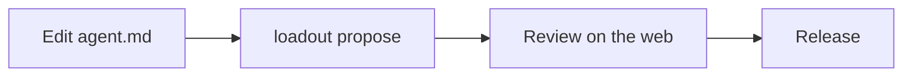

# Propose a version

When you change an agent, propose it instead of publishing. A teammate reviews it on the web page.

```mermaid
flowchart LR
  edit[Edit agent.md] --> propose[loadout propose] --> review[Review on the web] --> release[Release]
```

Back to [setting up](01-setup.md), or on to [review](04-review.md).
