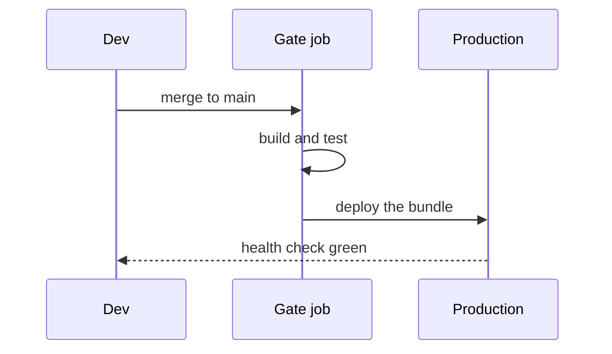

# How a deploy works

A merge to main starts the gate job. When something goes wrong, see [Roll back a release](rollback.md) and the [flow diagram](../diagrams/deploy-flow.mmd).

```mermaid
sequenceDiagram
  participant Dev
  participant Gate as Gate job
  participant Prod as Production
  Dev->>Gate: merge to main
  Gate->>Gate: build and test
  Gate->>Prod: deploy the bundle
  Prod-->>Dev: health check green
```
